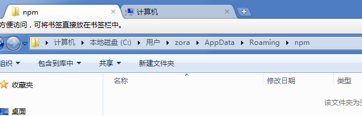
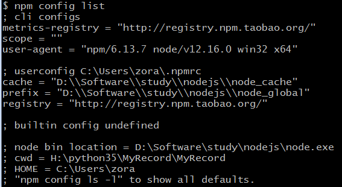
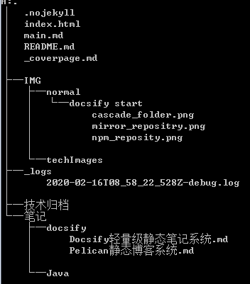
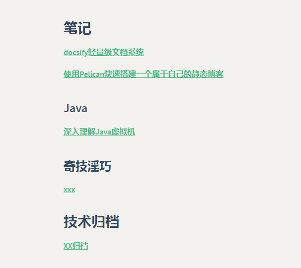

## Docsify轻量级静态

### 1.Docsify简介

Docsify 是一个动态生成文档网站的工具。不同于 GitBook、Hexo、Pelican 的地方是它不会生成将 .md 转成 .html 文件，所有转换工作都是在运行时进行。这将非常实用，如果只是需要快速的搭建一个小型的文档网站，或者不想因为生成的一堆 .html 文件“污染” commit 记录，只需要创建一个 index.html 就可以开始写文档而且直接部署在 GitHub Pages。

### 2.安装Nodejs

#### Nodejs下载

下载地址：https://nodejs.org/en/ 

#### 安装Nodejs

安装nodejs请参考链接：https://www.cnblogs.com/jianguo221/p/11487532.html

记得选中Add to PATH

安装完后执行

```
node -v
$ node -v
v12.16.0

npm -v
$ npm -v
6.13.7
```

#### 修改npm本地仓库地址

安装后发现，npm的本地仓库在系统盘C盘的用户目录(没见到npm-cache是因为没有用过，

一使用缓存目录就生成了)，试图将目录移动到nodejs的安装目录



先在nodejs的安装目录新建目录

node_cache

node_global

然后运行命令

```
npm config set prefix "D:\Software\study\nodejs\node_global"
npm config set cache "D:\Software\study\nodejs\node_cache"
```

执行npm list -global可以看到npm的本地仓库已经发生改变

#### 配置nmp像站

npm config set registry=http://registry.npm.taobao.org



npm config get registry 可查看镜像仓库地址

检查镜像仓库地址是否可用，可以使用如下命令看能否获取vue的信息

npm info vue

npm install npm -g 将安装最新npm, -g安装到global目录

### 3.安装Docsify

安装docsify

本地安装docsify-cli工具，可以方便地创建及本地预览文档网站。我本地已经安装了docsify-cli，这里会更新版本

```undefined
npm i docsify-cli -g

$ npm i docsify-cli -g
D:\Software\study\nodejs\node_global\docsify -> D:\Software\study\nodejs\node_global\node_modules\docsify-cli\bin\docsify
npm WARN optional SKIPPING OPTIONAL DEPENDENCY: fsevents@1.2.11 (node_modules\docsify-cli\node_modules\fsevents):
npm WARN notsup SKIPPING OPTIONAL DEPENDENCY: Unsupported platform for fsevents@1.2.11: wanted {"os":"darwin","arch":"any"} (current: {"os":"win32","arch":"x64"})

+ docsify-cli@4.4.0
updated 2 packages in 19.916s
```

### 4.Quick-start

#### init初始化一个项目

本地创建目录test， 在该目录下docsify init

```
mkdir test
docsify init .

zora@zora-PC MINGW64 /h/python35/MyRecord/test
$ docsify init .

执行docsify init后回显初始化成功:
Initialization succeeded! Please run docsify serve .

在当前test目录会自动生成index.html和README.md文件
zora@zora-PC MINGW64 /h/python35/MyRecord/test
$ ll
total 5
-rw-r--r-- 1 zora 197121 633 二月   29 23:12 index.html
-rw-r--r-- 1 zora 197121  37 十月   26  1985 README.md

```

```css
index.html 入口文件
README.md 会做为主页内容渲染
.nojekyll 用于阻止 GitHub Pages 会忽略掉下划线开头的文件
```

#### 开始写文档

修改index.html中关于关于网页设置的JS脚本window.$docsify

```
<body>
  <div id="app">加载中...</div>
  <script>
    window.$docsify = {
      name: 'Muzeet的个人笔记',
      repo: 'https://github.com/muzeet/MyRecord',
	  loadSidebar: false,
	  homepage: 'main.md',
	  search: {
            paths: 'auto',
            placeholder: '🔍 Search ',
            noData: '😞 No Results! ',
            depth: 6
        },
        coverpage: true
    }
  </script>
  <script src="https://cyc-1256109796.cos.ap-guangzhou.myqcloud.com/docsify.min.js"></script>
  <!-- 上面的基本不可用，无法搜索 -->
  <script src="https://cdn.bootcss.com/docsify/4.5.9/plugins/search.min.js"></script>
  <script src="https://cyc-1256109796.cos.ap-guangzhou.myqcloud.com/docsify-copy-code.min.js"></script>
  <script src="https://cyc-1256109796.cos.ap-guangzhou.myqcloud.com/prism-java.min.js"></script>
  <script src="https://cyc-1256109796.cos.ap-guangzhou.myqcloud.com/prism-c.min.js"></script>
  <script src="https://cyc-1256109796.cos.ap-guangzhou.myqcloud.com/prism-bash.min.js"></script>
  <script src="https://cyc-1256109796.cos.ap-guangzhou.myqcloud.com/prism-sql.min.js"></script>
  <script src="https://cyc-1256109796.cos.ap-guangzhou.myqcloud.com/zoom-image.min.js"></script>
</body>
```

页面显示设置

```
name: 'Muzeet的个人笔记' // 显示在首页Title名称
repo: 'https://github.com/muzeet/MyRecord' // 会在页面的右上角生成github的页脚链接
loadSidebar: false, // 不显示侧边栏
homepage: 'main.md' // 加载主页，需要在项目根目录创建main.md的主页
search: { // 设置站内搜索框
	paths: 'auto',
	placeholder: '🔍 Search ',
	noData: '😞 No Results! ',
	depth: 6
},
coverpage: true
```

main.md设置

主页以多级标题加列表形式显示所有文档的链接。链接样式：[超链接文字描述]（相对根目录的文档相对路径）。设置loadSidebar为false， 会默认把main.md中的多级目录显示在侧边栏。

```
## 笔记

[docsify轻量级文档系统](笔记/docsify/docsify轻量级.md)

[使用Pelican快速搭建一个属于自己的静态博客](笔记/docsify/docsify轻量级.md)

### Java

[深入理解Java虚拟机](笔记/Java/)

### 奇技淫巧

[xxx](笔记/Java/)

## 技术归档

[XX归档](技术归档/)
```

我的目录结构， Windows下使用 `tree /F` 命令可以显示目录树



#### 本地预览效果

通过执行命令`docsify serve` 会运行一个本地的服务器来预览加载本地的文档，提供LiveReload 功能，可以实时预览。默认地址访问 `http://localhost:3000`

```
docsify serve . // .表示当前目录

$ docsify serve .

Serving H:\python35\MyRecord\MyRecord now.
Listening at http://localhost:3000

```

如果需要启动其他端口，可以直接在后面增加`-p 4000`表示启动端口为4000

更多命令行工具用法，参考 [docsify-cli](https://github.com/docsifyjs/docsify-cli) 文档。

我的主页显示样式




我的个人在线笔记系统：[MyRecord](http://www.muzeet.cn/MyRecord/)

