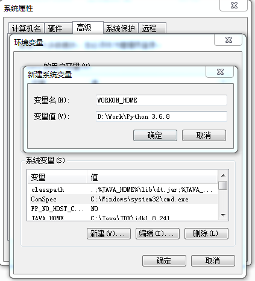

## 搭建Pelican博客系统

### 1.介绍

Pelican是一套开源的使用Python编写的博客静态生成, 可以添加文章和和创建页面, 可以使用MarkDown reStructuredText 和 AsiiDoc 的格式来抒写, 同时使用 Disqus评论系统, 支持 RSS和Atom输出, 插件, 主题, 代码高亮等功能, 采用Jajin2模板引擎, 可以很容易的更改模板。

### 2.安装前准备

- Mingw：生成静态页面时需要使用到Make， Windows环境需要安装Mingw创建包含GCC和Make的环境
- Python3：Pelican是Python平台的静态页面生成器，需要安装Python3
- Pelican：
- Markdown：Pelican支持Markdown

### 3.安装

#### Mingw安装

https://www.cnblogs.com/herelsp/p/8679200.html

https://www.cnblogs.com/lidabo/p/8990348.html

找到mingw安装目录下mingw32-make.exe拷贝一份并重命名为make.exe

mingw32-base

mingw32-gcc

mingw32-gcc-g++

mingw32-libgcc

mingw32-make

执行`gcc -v` 和`make -v`回显如下，安装成功

```
C:\Users\zora>gcc -v
Using built-in specs.
COLLECT_GCC=gcc
COLLECT_LTO_WRAPPER=d:/software/mingw/bin/../libexec/gcc/mingw32/6.3.0/lto-wrapp
er.exe
Target: mingw32
Configured with: ../src/gcc-6.3.0/configure --build=x86_64-pc-linux-gnu --host=m
ingw32 --target=mingw32 --with-gmp=/mingw --with-mpfr --with-mpc=/mingw --with-i
sl=/mingw --prefix=/mingw --disable-win32-registry --with-arch=i586 --with-tune=
generic --enable-languages=c,c++,objc,obj-c++,fortran,ada --with-pkgversion='Min
GW.org GCC-6.3.0-1' --enable-static --enable-shared --enable-threads --with-dwar
f2 --disable-sjlj-exceptions --enable-version-specific-runtime-libs --with-libic
onv-prefix=/mingw --with-libintl-prefix=/mingw --enable-libstdcxx-debug --enable
-libgomp --disable-libvtv --enable-nls
Thread model: win32
gcc version 6.3.0 (MinGW.org GCC-6.3.0-1)

C:\Users\zora>make -v
GNU Make 3.81
Copyright (C) 2006  Free Software Foundation, Inc.
This is free software; see the source for copying conditions.
There is NO warranty; not even for MERCHANTABILITY or FITNESS FOR A
PARTICULAR PURPOSE.

This program built for i386-pc-mingw32
```

#### Python3安装

#### 配置Virtualenv

##### virtualenv 安装虚拟环境

所有的第三方的包都会被pip安装到Python3的`site-packages`目录下，如果同时开发了多个应用程序，将共用一个python，为避免不同应用程序需要不同的第三方包版本，可以让每个应用各自拥有有一套独立的Python运行环境。virtualenv可以实现为每个应用创建隔离的Python运行环境。

首先，用`pip`安装virtualenv:

`pip install virtualenv`

如何创建一个独属于某个应用的Python运行环境？接下来这么操作：

第一步：在Python安装目录下创建某应用独立的Python运行环境目录，命名为`pelican-env`:

第二步：创建一个独立的Python运行环境，`virtualenv pelican-env`

创建指定版本虚拟环境`virtualenv -p python目录 虚拟环境`

```
$ virtualenv pelican-env
created virtual environment CPython3.6.8.final.0-64 in 3649ms
  creator CPython3Windows(dest=D:\Work\Python 3.6.8\pelican-env, clear=False, global=False)
  seeder FromAppData(download=False, pip=latest, setuptools=latest, wheel=latest, via=copy, app_data_dir=C:\Users\zora\AppData\Local\Temp\tmp9n59muil\seed-app-data\v1)
  activators BashActivator,BatchActivator,FishActivator,PowerShellActivator,PythonActivator,XonshActivator

```

命令`virtualenv`就可以创建一个独立的Python运行环境

```
zora@zora-PC MINGW64 /d/Work/Python 3.6.8/pelican-env
$ ll
total 13
drwxr-xr-x 1 zora 197121   0 三月    7 09:42 Lib/
-rw-r--r-- 1 zora 197121 272 三月    7 09:42 pyvenv.cfg
drwxr-xr-x 1 zora 197121   0 三月    7 09:42 Scripts/

```

第三步：进入该运行环境

```
执行source activate 或者activate.bat进入虚拟环境，出现(pelican-env)表示已进入虚拟环境

zora@zora-PC MINGW64 /d/Work/Python 3.6.8/pelican-env
$ cd Scripts/

zora@zora-PC MINGW64 /d/Work/Python 3.6.8/pelican-env/Scripts
$ source activate
(pelican-env)
zora@zora-PC MINGW64 /d/Work/Python 3.6.8/pelican-env/Scripts

```

第四步：查看该虚拟环境下，安装了哪些Python包

```
pip list
zora@zora-PC MINGW64 /d/Work/Python 3.6.8/pelican-env/Scripts
$ pip list
Package    Version
---------- -------
pip        20.0.2
setuptools 45.2.0
wheel      0.34.2
(pelican-env)
```

第五步：在该虚拟环境下，安装python包

```
pip install xxx

zora@zora-PC MINGW64 /d/Work/Python 3.6.8/pelican-env/Scripts
$ pip install django
Collecting django
  Downloading Django-3.0.4-py3-none-any.whl (7.5 MB)
Collecting pytz
  Using cached pytz-2019.3-py2.py3-none-any.whl (509 kB)
Collecting asgiref~=3.2
  Downloading asgiref-3.2.3-py2.py3-none-any.whl (18 kB)
Collecting sqlparse>=0.2.2
  Downloading sqlparse-0.3.1-py2.py3-none-any.whl (40 kB)
Installing collected packages: pytz, asgiref, sqlparse, django
Successfully installed asgiref-3.2.3 django-3.0.4 pytz-2019.3 sqlparse-0.3.1
(pelican-env)
zora@zora-PC MINGW64 /d/Work/Python 3.6.8/pelican-env/Scripts
$ pip list
Package    Version
---------- -------
asgiref    3.2.3
Django     3.0.4
pip        20.0.2
pytz       2019.3
setuptools 45.2.0
sqlparse   0.3.1
wheel      0.34.2
(pelican-env)
```

第六步：退出虚拟环境

```
deactivate
or
deactivate.bat
```

##### 快捷进入虚拟环境方式

通过以上方式即可创建一个虚拟环境，但是使用上面这种方式需要记住每一个虚拟环境的目录，可以设置快捷进入虚拟环境方式

下载virtualenvwrapper-win 包

`pip install virtualenvwrapper-win`

在windows cmd查看workon是否可用

```
C:\Users\zora>workon

Pass a name to activate one of the following virtualenvs:
==============================================================================
找不到文件
```

使用virtualenvwrapper创建虚拟环境

默认的虚拟环境目录会放在C:\Users\zora\Envs\目录下

```
D:\Work\Python 3.6.8>mkvirtualenv env1
 C:\Users\zora\Envs is not a directory, creating
created virtual environment CPython3.6.8.final.0-64 in 3303ms
  creator CPython3Windows(dest=C:\Users\zora\Envs\env1, clear=False, global=Fals
e)
  seeder FromAppData(download=False, pip=latest, setuptools=latest, wheel=latest
, via=copy, app_data_dir=C:\Users\zora\AppData\Local\Temp\tmp6l8inid5\seed-app-d
ata\v1)
  activators BashActivator,BatchActivator,FishActivator,PowerShellActivator,Pyth
onActivator,XonshActivator

(env1) D:\Work\Python 3.6.8>
```

存放路径，配置`WORKON_HOME`



虚拟环境目录变换会导致之前创建的虚拟环境不可用，可将之前创建的虚拟环境拷贝到新目录下。再次执行`workon`

新建虚拟环境

`mkvirtualenv xx`

`mkvirtualenv --python="python目录/python.exe" xxx`

```
C:\Users\zora>mkvirtualenv env2
created virtual environment CPython3.6.8.final.0-64 in 2986ms
  creator CPython3Windows(dest=D:\Work\Python 3.6.8\env2, clear=False, global=Fa
lse)
  seeder FromAppData(download=False, pip=latest, setuptools=latest, wheel=latest
, via=copy, app_data_dir=C:\Users\zora\AppData\Local\Temp\tmpkdzlvg1a\seed-app-d
ata\v1)
  activators BashActivator,BatchActivator,FishActivator,PowerShellActivator,Pyth
onActivator,XonshActivator
```

可以看到，虚拟环境的默认目录已发生变化

总结下快捷方式下这些基础命令

```
1.创建virtualenv虚拟环境
 mkvirtualenv pelican-env
2.查看虚拟环境下安装了那些包
 pip list
3.安装python包
 pip install xxx
4.查看当前共有多少虚拟环境
 workon
5.进入虚拟环境
 workon 虚拟环境名
6.退出虚拟环境
 deactivate
7.删除虚拟环境
 退出虚拟环境后执行
 rmvirtualenv 虚拟环境名　
```

#### Pelican安装

##### 安装pelican markdown

`pip install markdown`

```
(pelican-env)
zora@zora-PC MINGW64 /d/Work/Python 3.6.8/pelican-env/Scripts
$ pip install pelican markdown
Collecting pelican
  Using cached pelican-4.2.0-py2.py3-none-any.whl (258 kB)
Collecting markdown
  Using cached Markdown-3.2.1-py2.py3-none-any.whl (88 kB)
Collecting jinja2>=2.7
Successfully built blinker
Installing collected packages: MarkupSafe, jinja2, six, feedgenerator, unidecode, blinker, python-dateutil, docutils, pygments, pelican, markdown
Successfully installed MarkupSafe-1.1.1 blinker-1.4 docutils-0.16 feedgenerator-1.9.1 jinja2-2.11.1 markdown-3.2.1 pelican-4.2.0 pygments-2.5.2 python-dateutil-2.8.1 six-1.14.0 unidecode-1.1.1
```

```
$ pelican --version
4.2.0
```

##### Show versions

```
$ pip freeze
appdirs==1.4.3
blinker==1.4
distlib==0.3.0
docutils==0.16
feedgenerator==1.9.1
filelock==3.0.12
importlib-metadata==1.5.0
importlib-resources==1.3.1
Jinja2==2.11.1
Markdown==3.2.1
MarkupSafe==1.1.1
pelican==4.2.0
Pygments==2.5.2
python-dateutil==2.8.1
pytz==2019.3
six==1.14.0
Unidecode==1.1.1
virtualenv==20.0.8
virtualenvwrapper-win==1.2.6
zipp==3.1.0

```


#### Markdown安装

`pip install markdown`

### 4. 开始创建博客系统Step by step

#### quickstart

#### 写一篇文章

#### 生成静态页面

```
make html

make DEBUG=1 html

pelican content -o output -s publishconf.py

git branch --set-upstream-to=origin/gh-pages
```

#### 本地预览

```
./develop_server.sh start
```

#### FAQ

##### pelican4.x与jinja2不兼容

```
现象是
File "H:\python35\OxCAFEBABE\themes\Responsive-Pelican\templates\baseArticle.html", line 37, in block "head"
    <link href="{{ FEED_DOMAIN }}/{{ CATEGORY_FEED_ATOM|format(category.slug) }}" type="application/atom+xml" rel="alternate" title="{{ SITENAME }} Categories Atom Feed" />
  File "d:\work\python 3.6.8\lib\site-packages\jinja2\filters.py", line 823, in do_format
    return soft_unicode(value) % (kwargs or args)
TypeError: not all arguments converted during string formatting
make: *** [html] 错误 1


To these (note the slug= additions to the format invocation):

<link href="{{ FEED_DOMAIN }}/{{ CATEGORY_FEED_ATOM|format(slug=category.slug) }}" type="application/atom+xml" rel="alternate" title="{{ SITENAME }} Categories Atom Feed" />
<link href="{{ FEED_DOMAIN }}/{{ CATEGORY_FEED_RSS|format(slug=category.slug) }}" type="application/rss+xml" rel="alternate" title="{{ SITENAME }} Categories
RSS Feed" />

```

参考：https://github.com/getpelican/pelican/issues/2442


### 5.个人博客设计

本博客系统是采用了Pelican Responsive-Pelican样式模板，下面简单介绍本博客的结构

```

archives.html
article.html
base.html
baseArticle.html
categories.html
category.html
everyCategory.html
index.html
page.html
pagination.html
tag.html
tags.html
translations.html
```


base.html

```
<div id="container"> // 整个页面的Body
 <header></header> // Nav下拉选框
 <section id="wrapper" class="clearfix"> // body除head后的所有内容
   <section id="content" class="grid col-620" >
       // 仅是作为stub，在其他页面继承block content，可嵌入进来其他样式，并保持页面结构一致
      
   </section>
    // 右侧导航栏
   <section id="widgets" class="grid col-300 fit sidebar" >
      // 关于本人模块
       <section  id="widget-aboutme" class="widget-wrapper">
       </section>
     
      // 分类目录模块
       <section id="widget-category" class="widget-wrapper widget_archive">
       </section>
     
      // 最近文章模块
       <section id="widget-category" class="widget-wrapper widget_recentArticle">
       </section>
     
      // 最近评论模块
       <section id="widget-category" class="widget-wrapper widget_recentComments">
       </section>
     
      // 友情链接模块
       <section id="widget-links" class="widget-wrapper">
       </section>
     
      // 有用链接模块
       <section id="widget-links" class="widget-wrapper">
       </section>
     
      // 版本协议模块
       <section id="widget-copyright" class="widget-wrapper widget_archive">
       </section>
     
   </section>
   
 </section>
</div>
```


index.html

```

{% block content  // 继承自base.html中的block content
{{ super() }}
<ul>

<li class="posts">
<article class="post hentry">
	<header>
		<div class="post-info">
		<span class="post-lable">发布于：</span>
			<abbr class="date" title="{{ article.date.isoformat() }}"> 
				<a href="{{ SITEURL }}/archives/{{article.date|strftime("%Y/index.html")}}">{{ article.locale_date }} </a>
			</abbr>
		<span class="post-lable">分类：</span>
			<abbr class="category">
				<a href="{{ SITEURL }}/{{ article.category.url }}">{{ article.category }}</a>
			</abbr>
			<!-- COMMENTS -->
		</div>
		<h2 class="title" >
			<a href="{{ SITEURL }}/{{ article.url }}" rel="bookmark" title="Permalink to {{ article.title|striptags }}">{{ article.title }}</a>
		</h2>
		
	</header>
	<div class="summary">{{ article.content|truncate(1000) }}</div>
	<footer>
		<div class="readmore">
			<span class="more"><a href="{{ SITEURL }}/{{ article.url }}">继续阅读</a></span>
		</div>
	</footer>
</article>
</li>

<hr/>
</ul>


```


##### 代码高亮

如下链接列举了大概15 款代码语法高亮工具，其中重点使用了`Google Code Prettify`、`Highlight.js`、`Pygments`

https://www.jb51.net/article/77555.htm


**Pygments**

Pygments 是个通用代码语法高亮工具，许多常用的软件都使用了这款工具，比如论坛系统，wikis 或者其他需要美化代码的应用。 Pygments 支持范围非常广泛的编程语言，和大量的输出格式，包括 HTML, RTF, LaTeX 和 ANSI 序列。

https://segmentfault.com/a/1190000000661337


Pygments是唯一实验成功的代码高亮工具

[](https://imgchr.com/i/8xeBeP)


**安装Pygments**

**生成所需要的CSS文件**


##### 图床

路过图床

https://zhuanlan.zhihu.com/p/35270383


##### 评论系统

ISSO


分享按钮

https://blog.csdn.net/qq_40693828/article/details/81021071

```
<!-- bshare Button BEGIN -->
<div id="bshare">
  <div class="bshare-custom">
    <a title="分享到" href="http://www.bShare.cn/" id="bshare-shareto" class="bshare-more">分享到</a>
    <a title="分享到微信" class="bshare-weixin"></a>
    <a title="分享到有道云笔记" class="bshare-youdaonote"></a>
    <a title="分享到豆瓣" class="bshare-douban"></a>
    <a title="分享到电子邮件" class="bshare-email"></a>
    <a title="分享到新浪微博" class="bshare-sinaminiblog"></a>
    <a title="更多平台" class="bshare-more bshare-more-icon more-style-addthis"></a>
    <span class="BSHARE_COUNT bshare-share-count">0</span>
  </div>
  <script type="text/javascript" charset="utf-8" src="{{ SITEURL }}/theme/js/buttonLite.js#style=-1&amp;uuid=&amp;pophcol=2&amp;lang=zh"></script>
  <script type="text/javascript" charset="utf-8" src="{{ SITEURL }}/theme/js/bshareC0.js"></script>
</div>
<!-- bshare Button BEGIN -->
```


版本协议

```
<div class="grid col-300 copyright" >
					<a href="http://creativecommons.org/licenses/by-nc-sa/3.0/" rel="license">
						</img>
					</a>
		</div>
```


自适应页面设计

http://www.ruanyifeng.com/blog/2012/05/responsive_web_design.html

```
<!-- http://t.co/dKP3o1e -->
<!-- 针对手持设备优化，主要是针对一些老的不识别viewport的浏览器，比如黑莓 -->
<meta name="HandheldFriendly" content="true">
<!-- 微软的老式浏览器 -->
<meta name="MobileOptimized" content="320">
<!-- CSS3 自适应页面-->
<meta name="viewport" content="width=device-width,minimum-scale=1,maximum-scale=1">
```


1.手机横屏适配
2.解决代码生成问题
3.评论框
4.手机模式下wgets加框线