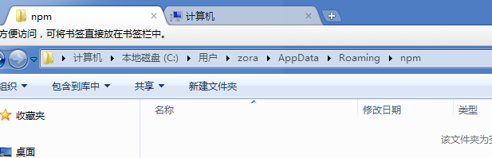
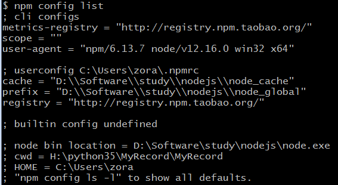

## docsify轻量级

### 安装nodejs

1.nodejs下载地址：https://nodejs.org/en/ 

2.安装nodejs

   选中Add to PATH

3.安装完后执行

```
node -v
$ node -v
v12.16.0

npm -v
$ npm -v
6.13.7
```

4.修改npm本地仓库地址

安装后发现，npm的本地仓库在系统盘C盘的用户目录(没见到npm-cache是因为没有用过，

一使用缓存目录就生成了)，试图将目录移动到nodejs的安装目录



先在nodejs的安装目录新建目录

node_cache

node_global

然后运行命令

```
npm config set prefix "D:\Software\study\nodejs\node_global"
npm config set cache "D:\Software\study\nodejs\node_cache"
```

执行npm list -global可以看到npm的本地仓库已经发生改变

5.配置镜像站

npm config set registry=http://registry.npm.taobao.org



npm config get registry 可查看镜像仓库地址

检查镜像仓库地址是否可用，可以使用如下命令看能否获取vue的信息

npm info vue

npm install npm -g 将安装最新npm, -g安装到global目录


### docsify安装

1.安装docsify

```undefined
npm i docsify-cli -g
```

2.